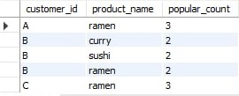

# Case Study #1-Danny's Dinner 👨🏻‍🍳

<div align="left">

</div>

# Contents

* [Introduction](#Introduction)
* [Problem Statement](#Problem-Statement)
* [Entity Relation Diagram](#Entity-Relationship-Diagram)
* [Case Study Questions and Solutions](#Case-Study-Questions-and-Solutions)
* [Bonus Questions and Solutions](URL)
* [Key Insights](URL)

# Introduction
In early 2021, Danny loves to eat Japanese food so he embark a risky venture to open up a cute little Japanese restaurant that sells 3 of his favourite foods like sushi, curry and ramen.However, lacking data analysis expertise, the restaurant struggles to leverage the basic data collected during its initial months to make informed business decisions. Danny's Diner seeks assistance using the data for him to make sure that the restaurant is runnning effectively.

# Problem Statement
Danny wants to use the data to answer a few simple questions about his customers, especially about their visiting patterns, how much money they’ve spent and also which menu items are their favourite. Having this deeper connection with his customers will help him deliver a better and more personalised experience for his loyal customers.

He plans on using these insights to help him decide whether he should expand the existing customer loyalty program - additionally he needs help to generate some basic datasets so his team can easily inspect the data without needing to use SQL.

Danny has provided you with a sample of his overall customer data due to privacy issues - but he hopes that these examples are enough for you to write fully functioning SQL queries to help him answer his questions!

Danny has shared with you 3 key datasets for this case study:
* Sales
* Menu
* Members

# Entity Relationship Diagram

<div align="left">

</div>

# Case Study Questions and Solutions

<strong>1. What is the total amount each customer spent at the restaurant?</strong>

```sql
SELECT S.customer_id AS customer_id, SUM(M.price) AS total_amount
FROM sales AS S
JOIN menu AS M
ON S.product_id = M.product_id
GROUP BY customer_id
ORDER BY customer_id;
```

**Answer:**

<div align="left">

</div>

* The SQL query retrieves the <code>customer_id</code> and calculate the sum of the price aliasing the name as the <code>(total_amount)</code> by each customer in the restaurant.
* It combines the <code>sales</code> and <code>menu</code> table based on matching each table's <code>product_id</code>.
* The results are grouped by <code>customer_id</code>.
* The query calculates each <code>customer_id</code> by the sum of the <code>price</code> of the product.
* Finally the results are alphabetically ordered by <code>customer_id</code>.

<strong>2. How many days has each customer visited the restaurant?</strong>

```sql
SELECT customer_id, COUNT(DISTINCT order_date) AS No_days
FROM sales
GROUP BY customer_id;
```

**Answer:**

<div align="left">

</div>

* The SQL query selects the <code>customer_id</code> and the unique count of the <code>order_date</code> aliasing the name as (No_days) for each customer.
* It retrieves the data to the <code>sales</code> table.
* The results are grouped by <code>customer_id</code>.
* The <code>COUNT(DISTINCT order_date)</code> calculates the number of uniques order dates for each customer.
* Finally, the query presents the <code>customer_id</code> and the total number of uniques order dates as <code>(No_days)</code>.

<strong>3. What was the first item from the menu purchased by each customer?</strong>

```sql
WITH first_order AS (SELECT S.customer_id, M.product_name,
			DENSE_RANK() OVER(ORDER BY S.order_date ASC) AS rank_order, S.order_date
			FROM sales AS S
                        JOIN menu AS M
                        ON S.product_id = M.product_id)
                        
SELECT customer_id,product_name, order_date
FROM first_order
WHERE rank_order = 1;
```

**Answer:**

<div align="left">

</div>

* The SQL query use a Common Table Expression named <code>(first_order)</code> to generate a temporary result.
* The CTE contains the following column <code>customer_id</code>, <code>product name</code>, <code>rank_order</code> and <code>order_date</code>.
* The **DENSE_RANK()** function assigns rank depending on the <code>order_date</code> and it is ranked in ascending order.
* The CTE <code>first_order</code> combines the table <code>sales</code> and <code>menu</code> on <code>product_id</code>.
* The main query gets the <code>customer_id</code>, <code>product_name</code>, and <code>order_date</code> column on the CTE named **first_order**.
* Lastly, main query filtered when the <code>rank_order</code> is equals to 1, which means the earliest purchase.

<strong>4. What is the most purchased item on the menu and how many times was it purchased by all customers?</strong>

```sql
SELECT M.product_name AS product_name, COUNT(M.product_name) AS times_purchased
FROM sales AS S
JOIN menu AS M
ON S.product_id = M.product_id
GROUP BY product_name
ORDER BY times_purchased DESC
LIMIT 1;
```

**Answer:**

<div align="left">

</div>

* The SQL query returns the column <code>product_name</code> and <code>times_purchased</code>.
* The <code>COUNT(M.product_name)</code> function counts the number of the <code>product_name</code> with the alias <code>times_purchased</code>.
* This table retrieves data in the <code>sales</code> and <code>menu</code> combined.
* Then it is grouped by <code>product_name</code> to calculate how many times a certain item is purchased.
* It is ordered by the <code>times_purchased</code> in descending order and with the limit of 1 to display the first value in the table row.

<strong>5. Which item was the most popular for each customer?</strong>

```sql
WITH popular AS (SELECT customer_id, product_name, COUNT(product_name) AS popular_count,
 			DENSE_RANK() OVER(PARTITION BY customer_id ORDER BY COUNT(product_name) DESC) AS ranks
			FROM sales AS S
                    	JOIN menu AS M
                    	ON S.product_id = M.product_id
                    	GROUP BY customer_id, product_name)

SELECT customer_id, product_name
FROM popular
WHERE ranks = 1;
```

**Answer:**

<div align="left">

</div>

* This SQL query creates a CTE named popular that retrieves the columns <code>customer_id</code>, <code>popular_count</code> and <code>ranks</code> from the combined table of <code>sales</code> and <code>menu</code>.
* The <code>COUNT(product_name)</code> in the CTE popular counts each product name.
* The <code>DENSE_RANK()</code> function ranks the counts of each product name by customer_id on descending order and they are grouped by <code>customer_id</code> and <code>product_name</code>.
* The main query returns the <code>customer_id</code> and <code>product_name</code> from the CTE named popular and filtered the ranks that is equal to 1.
* As a result, the query returns the customer's ID, the most ordered product, and the number of times it was ordered by that customer.

<strong>6. Which item was purchased first by the customer after they became a member?</strong>

```sql
WITH CTE AS (SELECT S.customer_id, product_name, order_date, join_date, DENSE_RANK() OVER(PARTITION BY S.customer_id ORDER BY order_date ASC) AS ranks
				FROM sales AS S
				LEFT JOIN menu AS M
				ON S.product_id = M.product_id
				LEFT JOIN members AS ME
				ON S.customer_id = ME.customer_id
				WHERE order_date > join_date) 
                
SELECT customer_id AS customer_id, product_name
FROM CTE
WHERE ranks = 1;
```

**Answer:**

<div align="left">

</div>

* The SQL query has a <mark>Common Table Expressions (CTE)</mark> named as CTE returns the column <code>customer_id</code>, <code>product_name</code>, <code>order_date</code>, <code>join_date</code> and <code>ranks</code>.
* The CTE retrieves its data from the 3 tables <code>sales</code>, <code>menu</code> and <code>members</code> joined.
* The <code>sales</code> table is joined to <code>menu</code> table on their product ID's while the <code>members</code> table is joined on <code>sales</code> table by their customer ID's.
* The result of CTE table filtered when the <code>order_date</code> is greater than the <code>join_date</code> to return the order of customers after they become a member.
* The main query returns the <code>customer_id</code> and <code>product_name</code> from the CTE table.
* Finally the result is filtered where the <code>ranks</code> column is equal to 1.

<strong>7. Which item was purchased just before the customer became a member?</strong>

```sql
SELECT S.customer_id, product_name
FROM sales AS S
LEFT JOIN menu AS M
ON S.product_id = M.product_id
LEFT JOIN members AS ME
ON S.customer_id = ME.customer_id
WHERE order_date < join_date;
```

**Answer:**

<div align="left">

</div>

* The SQL query returns the column <code>customer_id</code> and <code>product_name</code>.
* It retrieves the data from the joined table of <code>sales</code>, <code>menu</code> and <code>members</code>.
* The <mark>sales</mark> table and <mark>menu</mark> table are joined by their product ID's, while the <mark>members</mark> table and <mark>members</mark> table are joined by their customer ID's.
* Lastly, the code results return the <code>customer_id</code> and <code>product_name</code>, filtered when <code>order_date</code> is less than the <code>join_date</code>.

<strong>8. What is the total items and amount spent for each member before they became a member?</strong>

```sql
SELECT S.customer_id AS customer_id, COUNT(product_name) AS total_items, SUM(price) AS total_amount
FROM sales AS S
LEFT JOIN menu AS M
ON S.product_id = M.product_id
LEFT JOIN members AS ME
ON S.customer_id = ME.customer_id
WHERE order_date < join_date
GROUP BY customer_id;
```

**Answer:**

<div align="left">

</div>

* The SQL query returns the <code>customer_id</code>, <code>total_items</code> and <code>total_amount</code>.
* The data is retrieve from the <mark>sales</mark>, <mark>menu</mark> and <mark>members</mark> combined.
* The <mark>sales</mark> table is joined with <mark>menu</mark> table on their product ID's, while the <mark>members</mark> table and <mark>sales</mark> table are joined with their customer ID's.
* The <code>COUNT(product_name)</code> counts the product that each customer purchase and the <code>SUM(price)</code> gets the total of the price of each customer spends.
* The query is also filtered where the <code>order_date</code> is less than the <code>join_date</code> to get the purchases of each customer before they become a member.
* Finally, the query is grouped by <code>customer_id</code> to know what each customer bought before they become a member.

<strong>9. If each $1 spent equates to 10 points and sushi has a 2x points multiplier - how many points would each customer have?</strong>

```sql
WITH CTE AS (SELECT customer_id, CASE WHEN product_name = 'sushi' THEN price * 20 ELSE price * 10 END AS points
		FROM sales AS S
		LEFT JOIN menu AS M
		ON S.product_id = M.product_id)

SELECT customer_id, SUM(points) AS customer_points
FROM CTE
GROUP BY customer_id;
```

**Answer:**

<div align="left">

</div>

* The SQL query retrieves the <code>customer_id</code> and calculates the total points <code>(total_points)</code> earned by each customer based on their purchases from the sales and menu tables.
* It retrieves data from the <mark>sales</mark> table and joins it with the <mark>menu</mark> table based on matching <code>product_id</code>.
* The query uses a <code>CASE</code> statement to differentiate between 'sushi' and other products.
* If the product name is 'sushi', the price is multiplied by 2 to give double points.
Otherwise, the regular price is considered.
* The <code>SUM</code> function calculates the total points for each customer by adding up the points earned from their purchases.
* The total points are then multiplied by 10 to give a scaled value.
* Results are grouped by <code>customer_id</code> to get the total points for each customer.
* The query then presents the <code>customer_id</code> and the scaled total_points for each customer based on their purchases.
* Finally, the results are sorted in ascending order based on the <code>customer_id</code>.

<strong>10. In the first week after a customer joins the program (including their join date) they earn 2x points on all items, not just sushi - how many points do customer A and B have at the end of January?</strong>

```sql
WITH dates_table AS (SELECT customer_id,
                        join_date, 
                        join_date + INTERVAL 6 day AS first_week,
                        LAST_DAY('2021-01-01') AS last_date
                        FROM members)
                        
SELECT S.customer_id,
SUM(CASE WHEN M.product_name = 'sushi' OR (S.order_date BETWEEN dates_table.join_date AND dates_table.first_week) THEN M.price * 2 * 10
ELSE M.price * 10 END) AS points
FROM sales AS S
INNER JOIN dates_table
ON S.customer_id = dates_table. customer_id AND dates_table.join_date <= S.order_date
AND S.order_date <= dates_table.last_date
INNER JOIN menu AS M
ON S.product_id = M.product_id
GROUP BY S.customer_id
ORDER BY S.customer_id;
```

**Answer:**

<div align="left">

</div>

* The SQL query has a temporary table called dates_table and it returns the following columns <code>customer_id</code>, <code>join_date</code>, <code>first_week</code> and <code>last_date</code>.
* The data come from the <mark>members</mark> table.
* The CTE named dates_table generates the date ranges for each customers from their <code>join_date</code> to the 6 days after they joined and from the last day of January.
* The main query selects the <code>customer_id</code> and the sum of all the points each customer gained.
* The <code>SUM</code> function gets all the some of the points by each <code>customer_id</code>
* The main query also uses the <code>CASE</code> to met a certain condition like for the 'sushi' it has 2 times more points than the other food and on the first week of being a member each customer has a double points for their purchase in any food.
* If the product name is 'sushi' or the order date falls within the range of <code>join_date</code> to <code>valid_date</code>, the points are calculated as 2 times 10 times the price of the product.
* Otherwise, for other products, the points are calculated as 10 times the price of the product.
* Results are grouped by <code>customer_id</code> to get the total points for each customer.
* The query then presents the <code>customer_id</code> and the calculated points for each customer based on their purchases.
* Finally, the results are sorted in ascending order based on the <code>customer_id</code>.

# Bonus Questions and Solutions

<strong>Join All The Things</strong>

```sql
SELECT S.customer_id, order_date, product_name, price,
CASE WHEN order_date >= join_date THEN 'Y'
ELSE 'N' END AS member
FROM sales AS S
LEFT JOIN menu AS M
ON S.product_id = M.product_id
LEFT JOIN members AS ME
ON S.customer_id = ME.customer_id;
```

**Answer:**

<div align="left">

</div>

* The SQL query selects the column <code>customer_id</code>, <code>order_date</code>, <code>product_name</code> and <code>price</code>.
* This query uses <code>CASE</code> function 
