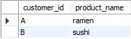

# Case Study #1-Danny's Dinner 👨🏻‍🍳

<div align="left">

</div>

# Contents

* [Introduction](#Introduction)
* [Problem Statement](#Problem-Statement)
* [Entity Relation Diagram](#Entity-Relationship-Diagram)
* [Case Study Questions and Solutions](#Case-Study-Questions-and-Solutions)
* [Bonus Questions and Solutions](URL)
* [Key Insights](URL)

# Introduction
In early 2021, Danny loves to eat Japanese food so he embark a risky venture to open up a cute little Japanese restaurant that sells 3 of his favourite foods like sushi, curry and ramen.However, lacking data analysis expertise, the restaurant struggles to leverage the basic data collected during its initial months to make informed business decisions. Danny's Diner seeks assistance using the data for him to make sure that the restaurant is runnning effectively.

# Problem Statement
Danny wants to use the data to answer a few simple questions about his customers, especially about their visiting patterns, how much money they’ve spent and also which menu items are their favourite. Having this deeper connection with his customers will help him deliver a better and more personalised experience for his loyal customers.

He plans on using these insights to help him decide whether he should expand the existing customer loyalty program - additionally he needs help to generate some basic datasets so his team can easily inspect the data without needing to use SQL.

Danny has provided you with a sample of his overall customer data due to privacy issues - but he hopes that these examples are enough for you to write fully functioning SQL queries to help him answer his questions!

Danny has shared with you 3 key datasets for this case study:
* Sales
* Menu
* Members

# Entity Relationship Diagram

<div align="left">

</div>

# Case Study Questions and Solutions

1. What is the total amount each customer spent at the restaurant?

```sql
SELECT S.customer_id AS customer_id, SUM(M.price) AS total_amount
FROM sales AS S
JOIN menu AS M
ON S.product_id = M.product_id
GROUP BY customer_id
ORDER BY customer_id;
```

**Answer:**

<div align="left">

</div>

* The SQL query retrieves the <mark>customer_id</mark> and calculate the sum of the price aliasing the name as the <mark>(total_amount)</mark> by each customer in the restaurant.
* It combines the <mark>sales</mark> and <mark>menu</mark> table based on matching each table's <mark>product_id</mark>.
* The results are grouped by <mark>customer_id</mark>.
* The query calculates each <mark>customer_id</mark> by the sum of the <mark>price</mark> of the product.
* Finally the results are alphabetically ordered by <mark>customer_id<mark>.

2. How many days has each customer visited the restaurant?

```sql
SELECT customer_id, COUNT(DISTINCT order_date) AS No_days
FROM sales
GROUP BY customer_id;
```

**Answer:**

<div align="left">

</div>

* The SQL query selects the <mark>customer_id</mark> and the unique count of the <mark>order_date</mark> aliasing the name as (No_days) for each customer.
* It retrieves the data to the <mark>sales</mark> table.
* The results are grouped by <mark>customer_id</mark>.
* The <mark>COUNT(DISTINCT order_date)</mark> calculates the number of uniques order dates for each customer.
* Finally, the query presents the <mark>customer_id</mark> and the total number of uniques order dates as <mark>(No_days)</mark>.

3. What was the first item from the menu purchased by each customer?

```sql
WITH first_order AS (SELECT S.customer_id, M.product_name,
			DENSE_RANK() OVER(ORDER BY S.order_date ASC) AS rank_order, S.order_date
			FROM sales AS S
                        JOIN menu AS M
                        ON S.product_id = M.product_id)
                        
SELECT customer_id,product_name, order_date
FROM first_order
WHERE rank_order = 1;
```

**Answer:**

<div align="left">

</div>

* The SQL query use a Common Table Expression named <mark>(first_order)</mark> to generate a temporary result.
* The CTE contains the following column <mark>customer_id</mark>, <mark>product name</mark>, <mark>rank_order</mark> and <mark>order_date</mark>.
* The **DENSE_RANK()** function assigns rank depending on the <mark>order_date</mark> and it is ranked in ascending order.
* The CTE <mark>first_order</mark> combines the table <mark>sales</mark> and <mark>menu</mark> on <mark>product_id</mark>.
* The main query gets the <mark>customer_id</mark>, <mark>product_name</mark>, and <mark>order_date</mark> column on the CTE named **first_order**.
* Lastly, main query filtered when the <mark>rank_order</mark> is equals to 1, which means the earliest purchase.

4. What is the most purchased item on the menu and how many times was it purchased by all customers?

```sql
SELECT M.product_name AS product_name, COUNT(M.product_name) AS times_purchased
FROM sales AS S
JOIN menu AS M
ON S.product_id = M.product_id
GROUP BY product_name
ORDER BY times_purchased DESC
LIMIT 1;
```

**Answer:**

<div align="left">

</div>

* The SQL query returns the column <mark>product_name</mark> and <mark>times_purchased</mark>.
* The <mark>COUNT(M.product_name)</mark> function counts the number of the <mark>product_name<mark> with the alias <mark>times_purchased</mark>.
* This table retrieves data in the <mark>sales</mark> and <mark>menu</mark> combined.
* Then it is grouped by <mark>product_name</mark> to calculate how many times a certain item is purchased.
* It is ordered by the <mark>times_purchased</mark> in descending order and with the limit of 1 to display the first value in the table row.

5. Which item was the most popular for each customer?

```sql
WITH popular AS (SELECT customer_id, product_name, COUNT(product_name) AS popular_count,
 			DENSE_RANK() OVER(PARTITION BY customer_id ORDER BY COUNT(product_name) DESC) AS ranks
			FROM sales AS S
                    	JOIN menu AS M
                    	ON S.product_id = M.product_id
                    	GROUP BY customer_id, product_name)

SELECT customer_id, product_name
FROM popular
WHERE ranks = 1;
```

**Answer:**

<div align="left">

</div>

* This SQL query creates a CTE named popular that retrieves the columns <mark>customer_id</mark>, <mark>popular_count</mark> and <mark>ranks</mark> from the combined table of <mark>sales</mark> and <mark>menu</mark>.
* The <mark>COUNT(product_name)</mark> in the CTE popular counts each product name.
* The <mark>DENSE_RANK()</mark> function ranks the counts of each product name by customer_id on descending order and they are grouped by <mark>customer_id</mark> and <mark>product_name</mark>.
* The main query returns the <mark>customer_id</mark> and <mark>product_name</mark> from the CTE named popular and filtered the ranks that is equal to 1.
* As a result, the query returns the customer's ID, the most ordered product, and the number of times it was ordered by that customer.

6. Which item was purchased first by the customer after they became a member?

```sql
WITH CTE AS (SELECT S.customer_id, product_name, order_date, join_date, DENSE_RANK() OVER(PARTITION BY S.customer_id ORDER BY order_date ASC) AS ranks
				FROM sales AS S
				LEFT JOIN menu AS M
				ON S.product_id = M.product_id
				LEFT JOIN members AS ME
				ON S.customer_id = ME.customer_id
				WHERE order_date > join_date) 
                
SELECT customer_id AS customer_id, product_name
FROM CTE
WHERE ranks = 1;
```

**Answer:**

<div align="left">

</div>

* The SQL query has a <mark>Common Table Expressions (CTE)</mark> named as CTE returns the column <mark>customer_id</mark>, <mark>product_name</mark>, <mark>order_date</mark>, <mark>join_date</mark> and <mark>ranks</mark>.
* The CTE retrieves its data from the 3 tables <mark>sales</mark>, <mark>menu</mark> and <mark>members</mark> joined.
* The <mark>sales</mark> table is joined to <mark>menu</mark> table on their product ID's while the <mark>members</mark> table is joined on <code>sales</code> table by their customer ID's.
* 


