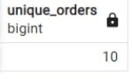
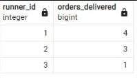
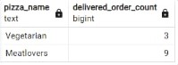
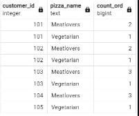
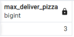
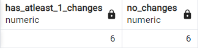
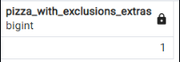
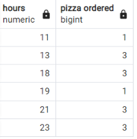
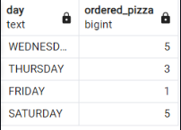

# Case Study #2 - Pizza Runner 🍕

<div>
  
</div>

# Contents

* [Introduction](#Introduction)
* [Problem Statement](#Problem-Statement)
* [Entity Relation Diagram](#Entity-Relationship-Diagram)
* [Case Study Questions and Solutions](#Case-Study-Questions-and-Solutions)
* [Bonus Questions and Solutions](URL)
* [Key Insights](URL)

# Introduction

Welcome to the Pizza Runner Case Study! Follow Danny's journey as he combines the irresistible allure of "80s Retro Styling and Pizza Is The Future" to launch Pizza Runner, an innovative venture in the pizza delivery industry. With his background in data science, Danny understands the significance of data collection for business growth. Now, he seeks assistance in cleaning and analyzing the data to optimize Pizza Runner's operations and guide his runners more efficiently. Join us as we explore how data-driven decisions propel Pizza Runner towards success and elevate the pizza delivery experience to new heights.

# Entity Relationship Diagram

<div>
  
</div>

# Data Cleaning and Transformation

* customer_orders table before...

<div>
  
</div>

* The customer_orders table consists of individual pizza orders, with each row representing a unique pizza.
* Key columns in the table are pizza_id, exclusions, and extras.
* Before utilizing the data for queries, the exclusions and extras columns require a data cleaning process to ensure accuracy and consistency.
* Data cleaning involves handling missing or null values in the exclusions and extras columns.
* The ingredient_id values in the exclusions and extras columns need to be standardized for uniformity.
* Inconsistencies and duplicates in the exclusions and extras data should be resolved to eliminate ambiguities.
* By performing thorough data cleaning, the customer_orders table will be optimized for effective analysis.
* The cleaned data will provide valuable insights into customer preferences, enabling better decision-making for Pizza Runner's operations.
* With accurate data, Pizza Runner can efficiently meet customer demands and deliver an enhanced pizza ordering experience.

```sql
DROP TABLE IF EXISTS customer_orders_tempp;
CREATE TABLE IF NOT EXISTS customer_orders_tempp AS
SELECT 
  order_id,
  customer_id,
  pizza_id,
  CASE 
    WHEN exclusions IS NULL OR exclusions LIKE 'null' THEN ''
    ELSE exclusions
  END AS exclusions,
  CASE 
    WHEN extras IS NULL OR extras LIKE 'null' THEN ''
    ELSE extras
  END AS extras,
  order_time
FROM customer_orders;

SELECT*
FROM customer_orders_temp
```
* customer_orders table after as customer_order_temp

<div>
  
</div>

* runners_orders table before

<div>
  
</div>

The data in the orders table of Pizza Runner contains valuable information regarding the assignment of orders to runners, including pickup times, distances, and durations. However, it is crucial to note that the table may have some known data issues that require careful handling during data cleaning.

Here are the key points to consider when cleaning the data in the orders table:

* Verify Data Types: Before proceeding with data cleaning, it is essential to check the data types for each column in the schema SQL.
* Ensuring accurate data types will prevent potential data type mismatches and errors in subsequent queries.
* Handle Incomplete Orders: Some orders may not be fully completed and can be canceled by either the restaurant or the customer. It is necessary to identify and properly handle these incomplete orders during the data cleaning process.
* Address Null Values: The table may contain null values in certain columns, such as pickup_time, distance, and duration. Properly handling these null values is crucial to avoid inaccuracies in the analysis.
* Validate Timestamps: The pickup_time column represents the timestamp when the runner arrives at Pizza Runner headquarters to pick up the pizzas. Validating and ensuring the consistency of these timestamps will be essential to maintain data integrity.
* Clean Distance and Duration: The distance and duration fields provide information about the runner's travel to deliver the order. * Cleaning these fields involves checking for any outliers or inconsistencies that may affect analysis results.
* Address Known Data Issues: As there are known data issues in the table, special attention must be given to resolving these issues during the data cleaning process. Identifying and rectifying data discrepancies will enhance the accuracy and reliability of the dataset.

```sql
DROP TABLE IF EXISTS runner_orders_temp;

CREATE TABLE runner_orders_temp AS(
	SELECT order_id
	   , runner_id
	   , CASE 
	   	   WHEN pickup_time IS null OR pickup_time LIKE 'null' THEN null
	       ELSE pickup_time
	     END pickup_time
	   , CASE 
	   	   WHEN distance IS null OR distance LIKE 'null' THEN null
	       WHEN distance LIKE '%km' THEN TRIM('km' from distance)
	       ELSE distance
	     END distance
	   , CASE 
	   	  WHEN duration IS null OR duration LIKE 'null' THEN null
	      WHEN duration LIKE '%mins' THEN TRIM('mins' from duration)
	      WHEN duration LIKE '%minute' THEN TRIM('minute' from duration)
	      WHEN duration LIKE '%minutes' THEN TRIM('minutes' from duration)
	      ELSE duration 
	     END duration
	   , CASE 
	   	   WHEN cancellation IS null OR cancellation LIKE 'null'
		   THEN ''
	       ELSE cancellation
	     END cancellation
	FROM runner_orders
	);

ALTER TABLE runner_orders_temp
	ALTER COLUMN pickup_time TYPE timestamp without time zone
	USING pickup_time::timestamp,
	ALTER COLUMN distance TYPE NUMERIC
	USING distance::numeric,
	ALTER COLUMN duration TYPE INT
	USING duration::integer;
		
SELECT*
FROM runner_orders_temp
```

* runner_orders table After AS runner_orders_temp

<div>
  
</div>

# Case Study Questions & Solutions

<strong>A. Pizza Metrics 🍕🍕<strong/>

1. How many pizzas were ordered?

```sql
SELECT COUNT(order_id) AS pizza_orders
FROM customer_orders_tempp
```

<strong>Answer:</strong>

<div>
  
</div>

* The SQL query selects the number of pizza orders (<code>pizza_orders</code>) from the <code>customer_orders_tempp</code> table.
* The <code>COUNT(order_id)</code> function calculates the total number of order IDs in the <code>customer_orders_tempp</code> table, effectively giving the count of pizza orders.
* As a result, the query presents the total count of pizza orders as <code>pizza_orders</code>.

2. How many unique customer orders were made?

```sql
SELECT COUNT(DISTINCT order_id) AS unique_orders
FROM customer_orders_tempp
```

<strong>Answer: </strong>

<div>
  
</div>

* The SQL query selects the number of unique orders (<code>unique_orders</code>) from the <code>customer_orders_tempp</code> table.
* The <code>COUNT(DISTINCT order_id)</code> function calculates the total count of distinct order IDs in the <code>customer_orders_tempp</code> table, effectively giving the count of unique orders.
* As a result, the query presents the total count of unique orders as unique_orders.

3. How many successful orders were delivered by each runner?

```sql
SELECT runner_id,COUNT(order_id)AS orders_delivered
FROM runner_orders_temp
WHERE cancellation=''
GROUP BY runner_id
```

<strong>Answer: </strong>

<div>
  
</div>

* The SQL query selects the <code>runner_id</code> and counts the number of orders delivered (<code>orders_delivered</code>) for each runner from the <code>runner_orders_temp</code> table.
* It retrieves data from the <code>runner_orders_temp</code> table.
* The query filters the data using the WHERE clause, selecting only the rows where the cancellation column is empty (i.e., no cancellation).
* Results are grouped by <code>runner_id</code>.
* The <code>COUNT(order_id)</code> function calculates the number of occurrences of each <code>order_id</code> in the <code>runner_orders_temp</code> table, giving the count of orders delivered by each runner.
* As a result, the query presents the total count of orders delivered as <code>orders_delivered</code> for each runner from the runner_orders_temp table.

4. How many of each type of pizza was delivered?

```sql
SELECT pizza_name,COUNT(C.pizza_id)AS delivered_order_count
FROM customer_orders_tempp C
JOIN runner_orders_temp R ON C.order_id=R.order_id
JOIN pizza_names PN ON C.pizza_id=PN.pizza_id
WHERE cancellation=''
GROUP BY pizza_name
```

<strong>Answer: </strong>

<div>
  
</div>

* The SQL query retrieves the pizza_name and counts the number of delivered orders for each pizza (<code>delivered_order_count</code>) from the customer_orders_tempp table.
* The SQL query retrieves the pizza_name and counts the number of delivered orders for each pizza (<code>delivered_order_count</code>) from the <code>customer_orders_tempp</code> table.
* It retrieves data from the <code>customer_orders_tempp</code> table and joins it with the <code>runner_orders_temp</code> table and the pizza_names table.
* The query performs joins between the tables based on matching <code>order_id</code>, <code>pizza_id</code>, and <code>pizza_name</code>.
* It also filters the data using the WHERE clause, selecting only the rows where the cancellation column is empty (i.e., no cancellation).
* Results are grouped by <code>pizza_name</code> to get the count of delivered orders for each pizza.
* The <code>COUNT(C.pizza_id)</code> function calculates the number of occurrences of each <code>pizza_id</code> in the <code>customer_orders_tempp</code> table, giving the count of delivered orders for each pizza.
* As a result, the query presents the total count of delivered orders as <code>delivered_order_count</code> for each pizza from the <code>customer_orders_tempp</code>, <code>runner_orders_temp</code>, and <code>pizza_names</code> tables.

5. How many Vegetarian and Meatlovers were ordered by each customer?

```sql
SELECT C.customer_id,PN.pizza_name,COUNT(PN.pizza_id)AS count_ord
FROM customer_orders_temp C
JOIN pizza_names PN ON C.pizza_id=PN.pizza_id
GROUP BY C.customer_id,PN.pizza_name
ORDER BY C.customer_id
```

<strong>Answer: <strong>

<div>
  
</div>

* The SQL query retrieves the <code>customer_id</code>, <code>pizza_name</code>, and counts the number of ordered pizzas for each customer and pizza combination (<code>count_ord</code>) from the <code>customer_orders_temp</code> table.
* It retrieves data from the <code>customer_orders_temp</code> table and joins it with the <code>pizza_names</code> table based on matching <code>pizza_id</code>.
* Results are grouped by both <code>customer_id</code> and <code>pizza_name</code> to calculate the count of ordered pizzas for each customer and pizza combination.
* The COUNT(<code>PN.pizza_id</code>) function calculates the number of occurrences of each pizza_id in the <code>customer_orders_temp</code> table, giving the count of ordered pizzas for each customer and pizza combination.
* As a result, the query presents the total count of ordered pizzas as <code>count_ord</code> for each customer and pizza combination from the customer_orders_temp and pizza_names tables.
* The final result is sorted in ascending order based on the <code>customer_id</code>.

6. What was the maximum number of pizzas delivered in a single order?

```sql
WITH CTE AS 
(SELECT C.order_id,COUNT(C.pizza_id) AS orders_delivered
FROM customer_orders_tempp C
JOIN runner_orders_temp R ON C.order_id=R.order_id
WHERE r.cancellation=''
GROUP BY C.order_id)

SELECT MAX(orders_delivered) AS max_deliver_pizza
FROM CTE
```

<strong>Answer: </strong>

<div>
  
</div>

* The SQL query starts by creating a Common Table Expression (CTE) named CTE.
* Within the CTE, it retrieves the order_id and calculates the number of pizzas delivered for each order (<code>orders_delivered</code>) from the <code>customer_orders_tempp</code> table.
* It performs an inner join between the <code>customer_orders_tempp</code> table and the <code>runner_orders_temp</code> table on matching <code>order_id</code> to get the pizza delivery information.
* The query filters the data using the WHERE clause, selecting only the rows where the cancellation column (cancellation) in the runner_orders_temp table is empty (i.e., no cancellation).
* Results are grouped by <code>order_id</code> to calculate the count of pizzas delivered for each order.
* The <code>COUNT(C.pizza_id)</code> function calculates the number of occurrences of each <code>pizza_id</code> in the customer_orders_tempp table, giving the count of pizzas delivered for each order.
* Next, the main query selects the maximum value of orders_delivered from the CTE CTE.
* The <code>MAX(orders_delivered)</code> function returns the maximum value of orders_delivered among all the orders.
* As a result, the query presents the maximum count of pizzas delivered as <code>max_deliver_pizza</code> among all the orders from the customer_orders_tempp and runner_orders_temp tables, excluding any orders with cancellations.

7. For each customer, how many delivered pizzas had at least 1 change and how many had no changes?

```sql
WITH CTE AS
(SELECT C.customer_id,
SUM(CASE WHEN C.exclusions!=''OR C.extras!=''THEN 1 ELSE 0 END) AS has_atleast_1_changes,
SUM(CASE WHEN C.exclusions=''AND C.extras=''THEN 1 ELSE 0 END) AS no_changes
FROM customer_orders_tempp C 
JOIN runner_orders_temp R ON C.order_id=R.order_id
WHERE R.cancellation=''
GROUP BY C.customer_id)

SELECT SUM(has_atleast_1_changes) AS has_atleast_1_changes,
    SUM(no_changes) AS no_changes
FROM CTE
```

<strong>Answer: </strong>

<div>
  
</div>

* The SQL query starts by creating a Common Table Expression (CTE) named CTE.
* Within the CTE, it retrieves the <code>customer_id</code> and calculates two aggregates:
	* has_atleast_1_changes - the count of customers who have at least one change in their orders.
 	* no_changes - the count of customers who have no changes in their orders (neither exclusions nor extras).
* It performs an inner join between the <code>customer_orders_tempp</code> table and the <code>runner_orders_temp</code> table on matching <code>order_id</code> to get the order information.
* The query filters the data using the WHERE clause, selecting only the rows where the cancellation column (<code>cancellation</code>) in the runner_orders_temp table is empty (i.e., no cancellation).
* The CASE statement is used to conditionally evaluate whether there are exclusions or extras in the orders for each customer.
* The SUM function is then used to calculate the totals of has_atleast_1_changes and no_changes for each customer.
* Next, the main query selects the sum of has_atleast_1_changes and no_changes from the CTE CTE.
* The SUM function returns the sum of these values, giving the total count of customers who have at least one change in their orders and the total count of customers who have no changes in their orders.
* As a result, the query presents the total count of customers with at least one change (<code>has_atleast_1_changes</code>) and the total count of customers with no changes (no_changes) among all the orders from the <code>customer_orders_tempp</code> and <code>runner_orders_temp</code> tables, excluding any orders with cancellations.

8. How many pizzas were delivered that had both exclusions and extras?

```sql
SELECT SUM(CASE WHEN C.exclusions!='' AND C.extras!='' THEN 1 ELSE 0 END) AS pizza_with_exclusions_extras
FROM customer_orders_tempp C
JOIN runner_orders_temp R ON C.order_id=R.order_id
WHERE R.cancellation=''
```

<strong>Answer: </strong>

<div>
  
</div>

* The SQL query calculates the count of pizzas with both exclusions and extras (<code>pizza_with_exclusions_extras</code>) from the <code>customer_orders_tempp</code> table.
* It performs an inner join between the <code>customer_orders_tempp</code> table and the <code>runner_orders_temp</code> table on matching <code>order_id</code> to get the order information.
* The query filters the data using the WHERE clause, selecting only the rows where the cancellation column (<code>cancellation</code>) in the <code>runner_orders_temp</code> table is empty (i.e., no cancellation).
* The CASE statement is used to conditionally evaluate whether there are both exclusions and extras in the orders for each pizza.
* The SUM function then calculates the total count of pizzas with both exclusions and extras by summing up the ones that meet the specified condition.
* As a result, the query presents the total count of pizzas with both exclusions and extras as <code>pizza_with_exclusions_extras</code> among all the orders from the <code>customer_orders_tempp</code> and <code>runner_orders_temp</code> tables, excluding any orders with cancellations.

9. What was the total volume of pizzas ordered for each hour of the day?

```sql
SELECT 
EXTRACT(HOURS FROM order_time) AS hours,
COUNT(order_id) AS "pizza ordered"
FROM customer_orders_tempp
GROUP BY hours
ORDER BY hours;
```

<strong>Answer: </strong>

<div>
  
</div>

* The SQL query selects the hours portion of the order_time and the count of orders (<code>pizza ordered</code>) from the <code>customer_orders_tempp</code> table.
* It uses the EXTRACT function with HOURS to extract the hour portion from the <code>order_time</code>.
* Results are grouped by the extracted hour value to calculate the count of orders for each hour.
* The <code>COUNT(order_id)</code> function calculates the number of occurrences of each <code>order_id</code> in the <code>customer_orders_tempp</code> table, giving the count of orders for each hour.
* The query presents the extracted hours as hours and the corresponding count of orders as pizza ordered.
* Finally, the results are sorted in ascending order based on the extracted hours.

10. What was the volume of orders for each day of the week?

```sql
SELECT to_char(order_time, 'DAY')AS day, COUNT(order_id) AS ordered_pizza
FROM customer_orders_tempp
GROUP BY 1
```

<strong>Answer: </strong>

<div>
  
</div>

* The SQL query selects the day of the week from the <code>order_time</code> and the count of orders (<code>ordered_pizza</code>) from the customer_orders_tempp table.
* It uses the <code>to_char</code> function to convert the <code>order_time</code> into a textual representation of the day of the week (DAY).
* Results are grouped by the textual representation of the day of the week to calculate the count of orders for each day.
* The <code>COUNT(order_id)</code> function calculates the number of occurrences of each <code>order_id</code> in the customer_orders_tempp table, giving the count of orders for each day of the week.
* The query presents the textual representation of the day of the week as day and the corresponding count of orders as <code>ordered_pizza</code>.
* Finally, the results are sorted based on the textual representation of the day of the week.

<strong>B. Runner and Customer Experience 💁‍♂️🍕</strong>

1. How many runners signed up for each 1 week period? (i.e. week starts 2021-01-01)

