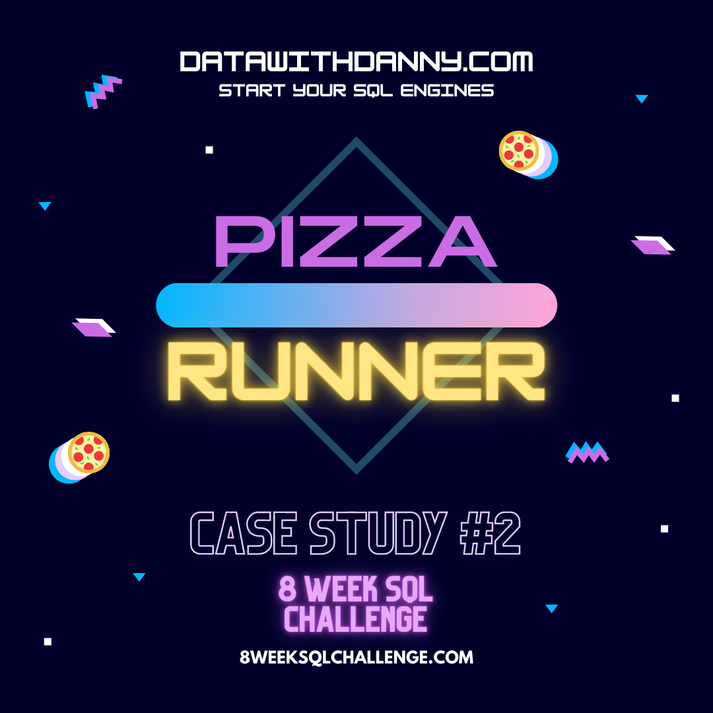
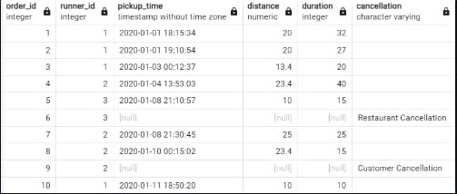

# Case Study #2 - Pizza Runner 🍕

<div>
  
</div>

# Contents

* [Introduction](#Introduction)
* [Problem Statement](#Problem-Statement)
* [Entity Relation Diagram](#Entity-Relationship-Diagram)
* [Case Study Questions and Solutions](#Case-Study-Questions-and-Solutions)
* [Bonus Questions and Solutions](URL)
* [Key Insights](URL)

# Introduction

Welcome to the Pizza Runner Case Study! Follow Danny's journey as he combines the irresistible allure of "80s Retro Styling and Pizza Is The Future" to launch Pizza Runner, an innovative venture in the pizza delivery industry. With his background in data science, Danny understands the significance of data collection for business growth. Now, he seeks assistance in cleaning and analyzing the data to optimize Pizza Runner's operations and guide his runners more efficiently. Join us as we explore how data-driven decisions propel Pizza Runner towards success and elevate the pizza delivery experience to new heights.

# Entity Relationship Diagram

<div>
  
</div>

# Data Cleaning and Transformation

* customer_orders table before...

<div>
  
</div>

* The customer_orders table consists of individual pizza orders, with each row representing a unique pizza.
* Key columns in the table are pizza_id, exclusions, and extras.
* Before utilizing the data for queries, the exclusions and extras columns require a data cleaning process to ensure accuracy and consistency.
* Data cleaning involves handling missing or null values in the exclusions and extras columns.
* The ingredient_id values in the exclusions and extras columns need to be standardized for uniformity.
* Inconsistencies and duplicates in the exclusions and extras data should be resolved to eliminate ambiguities.
* By performing thorough data cleaning, the customer_orders table will be optimized for effective analysis.
* The cleaned data will provide valuable insights into customer preferences, enabling better decision-making for Pizza Runner's operations.
* With accurate data, Pizza Runner can efficiently meet customer demands and deliver an enhanced pizza ordering experience.

```sql
DROP TABLE IF EXISTS customer_orders_tempp;
CREATE TABLE IF NOT EXISTS customer_orders_tempp AS
SELECT 
  order_id,
  customer_id,
  pizza_id,
  CASE 
    WHEN exclusions IS NULL OR exclusions LIKE 'null' THEN ''
    ELSE exclusions
  END AS exclusions,
  CASE 
    WHEN extras IS NULL OR extras LIKE 'null' THEN ''
    ELSE extras
  END AS extras,
  order_time
FROM customer_orders;

SELECT*
FROM customer_orders_temp
```
* customer_orders table after as customer_order_temp

<div>
  
</div>

* runners_orders table before

<div>
  
</div>

The data in the orders table of Pizza Runner contains valuable information regarding the assignment of orders to runners, including pickup times, distances, and durations. However, it is crucial to note that the table may have some known data issues that require careful handling during data cleaning.

Here are the key points to consider when cleaning the data in the orders table:

* Verify Data Types: Before proceeding with data cleaning, it is essential to check the data types for each column in the schema SQL.
* Ensuring accurate data types will prevent potential data type mismatches and errors in subsequent queries.
* Handle Incomplete Orders: Some orders may not be fully completed and can be canceled by either the restaurant or the customer. It is necessary to identify and properly handle these incomplete orders during the data cleaning process.
* Address Null Values: The table may contain null values in certain columns, such as pickup_time, distance, and duration. Properly handling these null values is crucial to avoid inaccuracies in the analysis.
* Validate Timestamps: The pickup_time column represents the timestamp when the runner arrives at Pizza Runner headquarters to pick up the pizzas. Validating and ensuring the consistency of these timestamps will be essential to maintain data integrity.
* Clean Distance and Duration: The distance and duration fields provide information about the runner's travel to deliver the order. * Cleaning these fields involves checking for any outliers or inconsistencies that may affect analysis results.
* Address Known Data Issues: As there are known data issues in the table, special attention must be given to resolving these issues during the data cleaning process. Identifying and rectifying data discrepancies will enhance the accuracy and reliability of the dataset.

```sql
DROP TABLE IF EXISTS runner_orders_temp;

CREATE TABLE runner_orders_temp AS(
	SELECT order_id
	   , runner_id
	   , CASE 
	   	   WHEN pickup_time IS null OR pickup_time LIKE 'null' THEN null
	       ELSE pickup_time
	     END pickup_time
	   , CASE 
	   	   WHEN distance IS null OR distance LIKE 'null' THEN null
	       WHEN distance LIKE '%km' THEN TRIM('km' from distance)
	       ELSE distance
	     END distance
	   , CASE 
	   	  WHEN duration IS null OR duration LIKE 'null' THEN null
	      WHEN duration LIKE '%mins' THEN TRIM('mins' from duration)
	      WHEN duration LIKE '%minute' THEN TRIM('minute' from duration)
	      WHEN duration LIKE '%minutes' THEN TRIM('minutes' from duration)
	      ELSE duration 
	     END duration
	   , CASE 
	   	   WHEN cancellation IS null OR cancellation LIKE 'null'
		   THEN ''
	       ELSE cancellation
	     END cancellation
	FROM runner_orders
	);

ALTER TABLE runner_orders_temp
	ALTER COLUMN pickup_time TYPE timestamp without time zone
	USING pickup_time::timestamp,
	ALTER COLUMN distance TYPE NUMERIC
	USING distance::numeric,
	ALTER COLUMN duration TYPE INT
	USING duration::integer;
		
SELECT*
FROM runner_orders_temp
```

* runner_orders table After AS runner_orders_temp

<div>
  
</div>

# Case Study Questions & Solutions

<strong>A. Pizza Metrics 🍕🍕<strong/>

1. How many pizzas were ordered?

```sql
SELECT COUNT(order_id) AS pizza_orders
FROM customer_orders_tempp
```

<div>
  
</div>

* The SQL query selects the number of pizza orders (<code>pizza_orders</code>) from the <code>customer_orders_tempp</code/> table.
* The <code>COUNT(order_id)</code> function calculates the total number of order IDs in the <code>customer_orders_tempp</code> table, effectively giving the count of pizza orders.
* As a result, the query presents the total count of pizza orders as <code>pizza_orders</code>.

2. How many unique customer orders were made?

```sql
SELECT COUNT(DISTINCT order_id) AS unique_orders
FROM customer_orders_tempp
```

* The SQL query selects the number of unique orders (<code>unique_orders</code>) from the <code>customer_orders_tempp</code> table.
* The <code>COUNT(DISTINCT order_id)</code> function calculates the total count of distinct order IDs in the <code>customer_orders_tempp</code> table, effectively giving the count of unique orders.
* As a result, the query presents the total count of unique orders as unique_orders.

